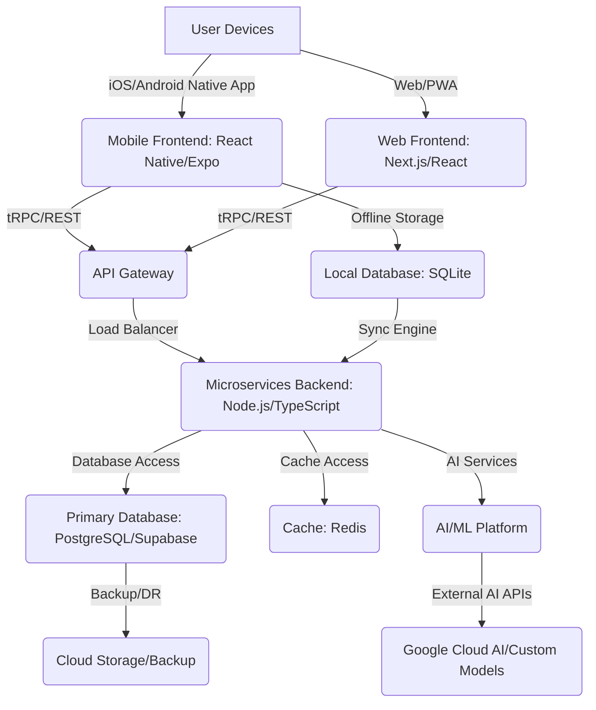

# MinaDent Application: Architecture Blueprint

**Status:** Draft  
**Version:** 1.0  
**Date:** 2026-06-19  
**Author:** Manus AI  
**Authority:** MASTER_SPECIFICATION.md, INFRASTRUCTURE_FOUNDATION_SPECS.md, COMPETITOR_AUDIT.md

---

## 1. Introduction

This document outlines the comprehensive technical architecture for the MinaDent application, designed to meet the stringent requirements for a world-class dental practice management system. The architecture is informed by the high standards of Iranian banking applications (Bank Mehr, Qbank), the latest iOS 26 development principles, and a thorough analysis of existing dental software solutions (MinaDent شرکتی بازار, برنامه لبخند). The goal is to build a robust, scalable, secure, and user-centric multi-platform application with advanced offline capabilities and AI integration.

---

## 2. High-Level Architecture Overview

MinaDent will adopt a **Microservices-oriented architecture** for its backend, communicating with a **Multi-Platform Frontend** (Native Mobile, PWA, Web) via a secure **API Gateway**. An **Offline-First** approach will be central to the mobile experience, leveraging local SQLite databases for data persistence and a sophisticated synchronization engine with Supabase (PostgreSQL) for cloud backup and real-time data consistency. AI services will be integrated for intelligent features.

---

## 3. Frontend Architecture

### 3.1 Mobile Frontend (iOS & Android Native App)

-   **Technology Stack:** React Native with Expo SDK 54+ and TypeScript.
-   **Framework:** Expo Router for navigation and routing.
-   **UI Framework:** NativeWind (Tailwind CSS for React Native) for utility-first styling, ensuring consistency and rapid development. Custom theming based on banking app aesthetics.
-   **State Management:** React Context + `useReducer`/`useState` for local state. TanStack Query for server-side data fetching and caching.
-   **Offline Data:** Expo SQLite for local data persistence. `AsyncStorage` for key-value storage.
-   **Localization:** Full RTL support, Persian fonts (Vazirmatn, IRANSans), and Jalali calendar integration.
-   **Animations:** `react-native-reanimated` for smooth, iOS 26 Class-style animations and micro-interactions.
-   **Biometrics:** `expo-local-authentication` for Face ID/Fingerprint login.
-   **Notifications:** `expo-notifications` for push and local notifications.
-   **3D View:** Integration with a suitable React Native library for 3D rendering (e.g., `react-native-gltf-model-viewer` or custom WebGL/OpenGL ES integration if needed for advanced features).

### 3.2 Web Frontend (PWA & Desktop Web App)

-   **Technology Stack:** Next.js with React and TypeScript.
-   **UI Framework:** Tailwind CSS for styling, sharing design tokens with NativeWind for consistency.
-   **Offline Capabilities (PWA):** Service Workers for caching assets and API responses, enabling offline access and installability.
-   **Routing:** Next.js file-system based routing.
-   **State Management:** React Context + `useReducer`/`useState`, TanStack Query.
-   **Localization:** Full RTL support, Persian fonts, and Jalali calendar integration.

### 3.3 Shared Components & Design System

-   A unified design system will be established, defining reusable UI components (buttons, inputs, cards, modals, etc.) that are consistent across all platforms.
-   Theme management will allow for light/dark modes and customizable accent colors, reflecting banking app flexibility.
-   Iconography will be managed to support dynamic changes and additions.

---

## 4. Backend Architecture (Microservices)

### 4.1 Core Services

-   **User Service:** Manages user authentication, authorization (RBAC), profiles (doctors, secretaries, assistants), and session management.
-   **Patient Service:** Manages comprehensive patient records, medical history, dental charts, and CRM functionalities.
-   **Scheduling Service:** Handles appointment booking, real-time timeline management, and resource allocation.
-   **Financial Service:** Manages payments, invoicing, financial reporting, and insurance claims.
-   **Inventory Service:** Tracks dental supplies, materials, and equipment, including Iranian product databases.
-   **Laboratory Service:** Manages fixed and mobile lab orders, tracking, and communication.
-   **Notification Service:** Manages push, SMS, and in-app notifications.
-   **AI Service:** Orchestrates AI functionalities like intelligent assistant (Mona), OCR for receipts, and cloud AI for mobile lab tracking.

### 4.2 Technology Stack

-   **Language:** Node.js with TypeScript.
-   **Framework:** Express.js for RESTful APIs.
-   **API Layer:** tRPC for type-safe end-to-end communication between frontend and backend.
-   **ORM:** Drizzle ORM for PostgreSQL interaction.
-   **Authentication:** JWT for token-based authentication, `jose` library for JWT handling.
-   **Security:** Helmet.js for HTTP security headers, `bcrypt` for password hashing.

---

## 5. Database Architecture

### 5.1 Primary Database (PostgreSQL via Supabase)

-   **Provider:** Supabase (PostgreSQL 15+).
-   **Schema Design:** Normalized schema for core entities (Users, Patients, Appointments, Payments, Inventory, Labs, etc.).
-   **Row-Level Security (RLS):** Implemented for fine-grained access control, ensuring data privacy and security.
-   **Extensions:** Utilize PostgreSQL extensions for advanced functionalities (e.g., PostGIS for location-based services if needed, `pg_trgm` for fuzzy search).
-   **Backup & Disaster Recovery:** Supabase's built-in backup mechanisms, complemented by custom strategies for critical data.

### 5.2 Local Database (SQLite)

-   **Provider:** Expo SQLite (or `react-native-sqlite-storage` for more advanced needs).
-   **Schema Design:** Optimized for offline access, potentially denormalized for read performance.
-   **Data Volume:** Capable of storing 200,000+ patient records and associated data.
-   **Encryption:** Encrypted SQLite databases for sensitive local data.

### 5.3 Cache (Redis)

-   **Purpose:** High-speed data retrieval, session management, rate limiting, and real-time data streams.
-   **Deployment:** Redis Cluster with Sentinel for high availability.

---

## 6. Offline-First & Synchronization Engine

-   **Core Principle:** All critical application functionalities (viewing patient data, scheduling, inventory management) must work seamlessly offline.
-   **Sync Mechanism:** A robust, event-driven synchronization engine will manage data flow between local SQLite and remote PostgreSQL (Supabase).
-   **Conflict Resolution:** Server-side timestamp wins for data conflicts, with intelligent merging strategies where applicable.
-   **Background Sync:** Utilize `expo-background-fetch` or native background tasks for periodic synchronization.
-   **Automatic Backup:** Local data will be automatically backed up to the cloud (Supabase) when internet connectivity is restored.
-   **Data Versioning:** Implement data versioning to track changes and facilitate rollbacks if necessary.

---

## 7. Security Architecture

-   **Authentication:** Multi-Factor Authentication (MFA) with Biometric (Face ID/Fingerprint), OTP, and strong password policies. JWT-based authentication with refresh tokens.
-   **Authorization:** Granular Role-Based Access Control (RBAC) implemented at both API Gateway and service levels (using RLS in PostgreSQL).
-   **Data Encryption:** AES-256-GCM for data at rest (database, local storage) and TLS 1.3 with Certificate Pinning for data in transit.
-   **Secure Storage:** Sensitive data (e.g., API keys, user tokens) stored securely using `expo-secure-store` on mobile and environment variables on the server.
-   **API Security:** Rate limiting, input validation, and protection against common web vulnerabilities (OWASP Top 10).
-   **Audit Trails:** Comprehensive logging of all user actions and system events for compliance and forensic analysis.
-   **Compliance:** Adherence to ISO 27001, PCI DSS, and OWASP Mobile Top 10 guidelines.

---

## 8. AI Integration

-   **Intelligent Assistant (Mona):** A dedicated AI service will power the virtual assistant, processing natural language queries, automating tasks, and providing proactive suggestions.
-   **OCR for Receipts:** Integration with a cloud-based OCR service (e.g., Google Cloud Vision AI) for scanning and extracting data from payment receipts.
-   **Cloud AI for Mobile Lab:** Leveraging AI for dynamic tracking, image analysis, and communication related to mobile lab orders.
-   **Future AI:** Architecture will be extensible to incorporate AI for diagnostics, predictive analytics, and personalized patient care.

---

## 9. Deployment & Operations

-   **CI/CD:** Automated pipelines (GitHub Actions/GitLab CI) for continuous integration, testing, and deployment across all platforms.
-   **Containerization:** Docker for packaging microservices.
-   **Orchestration:** Kubernetes for managing and scaling microservices.
-   **Monitoring & Logging:** Prometheus, Grafana, and ELK stack for real-time monitoring, alerting, and centralized logging.
-   **Disaster Recovery:** Comprehensive DR plan including regular backups, multi-region deployments, and failover mechanisms.

---

## 10. Key Deliverables for this Phase

-   **ARCHITECTURE_BLUEPRINT.md:** This document.
-   **Updated MASTER_SPECIFICATION.md:** Reflecting architectural decisions.
-   **Updated DEVELOPMENT_PROCESS_LOCKED.md:** Aligning with the architecture.

---

## 11. References

-   [MASTER_SPECIFICATION.md]
-   [INFRASTRUCTURE_FOUNDATION_SPECS.md]
-   [COMPETITOR_AUDIT.md]
-   [DEVELOPMENT_PROCESS_LOCKED.md]
-   Supabase Documentation
-   Expo Documentation
-   React Native Documentation
-   Next.js Documentation
-   PostgreSQL Documentation
-   Redis Documentation
-   OWASP Top 10 & Mobile Top 10
-   ISO 27001
-   PCI DSS
